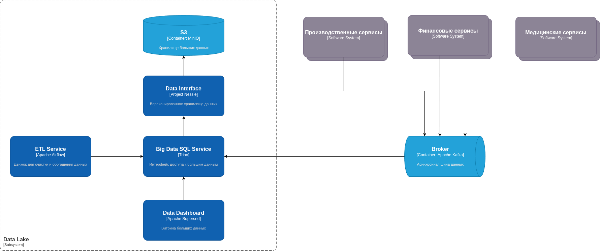

# Проектирование целевой архитектуры и оценка рисков внедрения

## Целевая архитектура

### Data Warehouse

Старый DWH уже не удовлетворяет потребностям бизнеса по производительности, и поэтому будет постепенно заменен новыми технологиями и выведен из эксплуатации.

- Исторические данные (архив) следует перенести в Data Lake (бронзовый слой) в исходном виде
- Бизнес-логику и трансформации данных переписать постепенно в Airflow
- Отчёты перевести на витрины в золотом слое Trino

Для того, чтобы старый DWH ещё работал параллельно какое-то время вместе с новым Data Lake, можно настроить коннектор Apache Kafka <--> Apache Camel таким образом, чтобы Kafka отдавала новые данные в Camel. Таким образом, старый DWH сможет получать обновления информации до тех пор, пока не будет полностью переработан на технологиях Data Lake.

### Data Lake

С учетом того, что в компании появятся новые отделы, и ожидается значительное увеличение объема данных, было решено построить Data Lake на базе облачных технологий Yandex. В качестве хранилища данных был выбран S3 на базе Yandes S3, т.к. он является наиболее популярным и имеет низкую стоимость хранения данных. 

Версионизированный интерфейс к данным в S3 будет предоставлять Project Nessie, который позволит эффективно работать с большим количеством версий данных. Для работы с данными в S3 будет использоваться Apache Iceberg, который позволит эффективно работать с большими объемами данных и обеспечивать их консистентность.

Для обработки данных будет использоваться Trino -- SQL-движок для больших данных, который позволяет работать с данными в S3 и Iceberg. Trino будет использоваться для выполнения аналитических запросов и построения витрин данных. При этом:

- В Trino настроены политики доступа на уровне схем (например, схема finance доступна только финансистам)
- PII-данные маскируются или псевдонимизируются в silver/gold слоях
- Все доступы к S3 — через IAM/политики, никаких открытых bucket'ов

Для работы с данными в Trino будет использоваться Apache Superset, который позволит строить витрины данных и предоставлять их пользователям.

Очистка и обогащение данных будет выполняться с помощью Apache Airflow. Он будет использоваться для выполнения ETL-процессов, преобразующих данные по схеме медальёнов (бронзовый, серебрянный, золотой слой данных).

Предлагается сделать единую точку входа данных на базе Apache Kafka. Для near-realtime обработки данных можно воспользоваться Kafka Streams.

## Карта рисков трансформации

| Риск                                                      | Вероятность | Влияние       | Описание                                                                                                                                             |
|-----------------------------------------------------------|-------------|---------------|------------------------------------------------------------------------------------------------------------------------------------------------------|
| R1. Несоответствие требованиям регуляторов                | Высокая     | Очень высокое | Медицинские и финансовые данные требуют особого контроля. Распределенная архитектура и облако усложняют compliance.                                  |
| R2. Нарушение целостности и согласованности данных        | Средняя     | Высокое       | В событийной архитектуре сложнее обеспечить ACID-транзакции на уровне нескольких доменов. Это может привести к расхождениям в финансовой отчетности. |
| R3. Зоопарк технологий                                    | Средняя     | Среднее       | Команды доменов могут начать использовать неподходящие или избыточные технологии, что усложнит поддержку и ротацию сотрудников.                      |
| R4. Риск безопасности из-за неправильной настройки облака | Средняя     | Высокое       | Ошибки в конфигурации прав доступа к облачным хранилищам (S3 bucket) или очередям Kafka могут привести к утечке данных.                              |

## План управления рисками

### R1. Несоответствие требованиям регуляторов

- Использовать геораспределенное развертывание облака с гарантией хранения данных РФ в ЦОДах на территории РФ.
- Шифрование данных в покое (AES-256) и при передаче (TLS). Управление ключами через KMS.
- Централизованный сбор и хранение всех действий с данными (кто, когда, к каким данным обращался) в неизменяемом виде.

### R2. Нарушение целостности и согласованности данных

- Внедрение паттерна SAGA распределенных транзакций для критичных процессов (например, оплата + запись к врачу). В случае сбоя одного из шагов, запускаются компенсирующие транзакции.
- Проектирование всех обработчиков событий как идемпотентных (повторная обработка события не приводит к изменению состояния).

### R3. Зоопарк технологий

Разработка гайдлайнов по используемым технологиям и паттернам, разработка архитектурных документов и best practices. Команды могут отклониться от этих документов, но это потребует серьзеного обоснования.

### R4. Риск безопасности из-за неправильной настройки облака

- Управление всей инфраструктурой через код (Terraform, CloudFormation). Это исключает "ручные" ошибки конфигурации и позволяет проводить code review.
- Настройка строгих IAM-политик для всех сервисов и людей по принципу наименьших привилегий.
